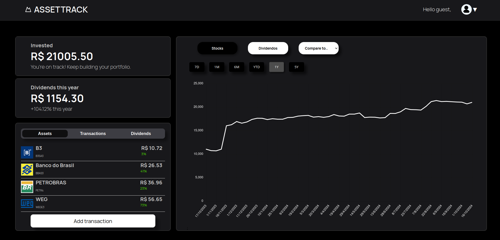
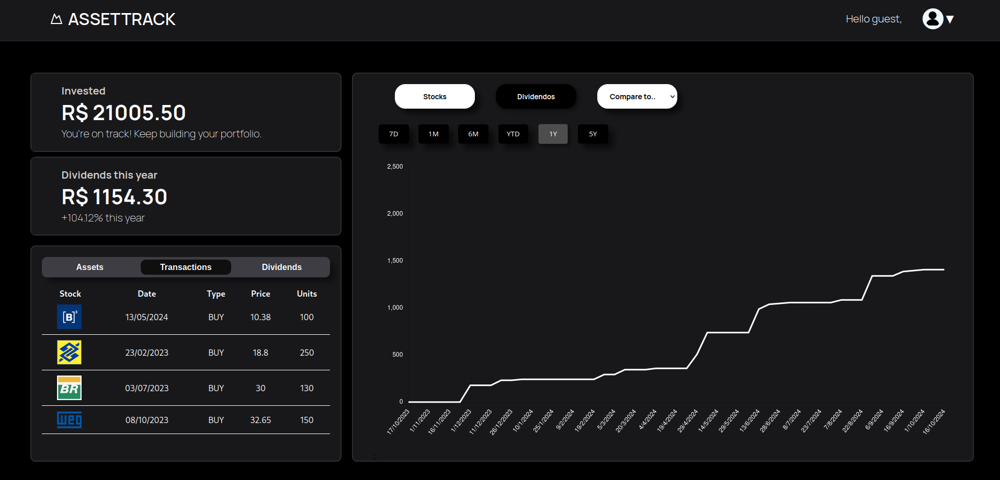
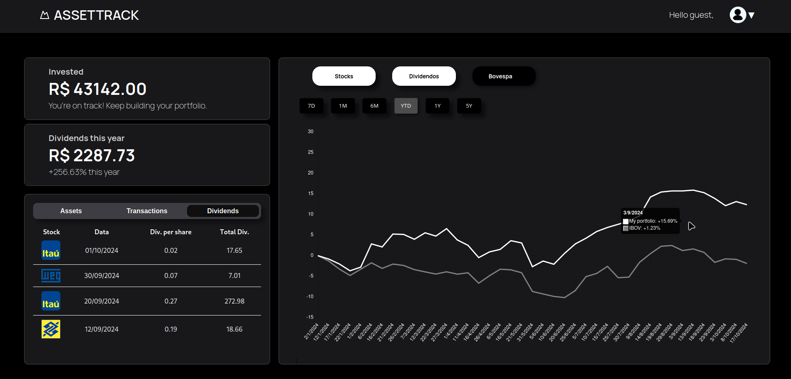

# Asset Track

O **Asset Track** é uma aplicação para rastreamento e gestão de ativos, permitindo que os usuários acompanhem investimentos, dividendos e a performance de suas carteiras ao longo do tempo.

## Funcionalidades

- **Rastreamento de Ativos em Tempo Real**: Monitore seus investimentos e ativos de forma contínua.
- **Visualização de Dividendos e Valor do Ativo**: Veja gráficos detalhados da performance dos ativos e dos dividendos distribuídos ao longo do tempo.
- **Gerenciamento Simples de Transações**: Adicione e gerencie suas transações de compra e venda de ativos.
- **Comparação com Índices de Mercado**: Compare a performance da sua carteira com índices de referência como o IBOV.

## Capturas de Tela

#### Visão Geral do Portfólio

*Descrição*: Interface para visualizar e gerenciar transações de ativos, exibindo o desempenho dos ativos ao longo do tempo.

#### Gráfico de Evolução dos Dividendos

*Descrição*: Exemplo de gráfico que apresenta a evolução dos dividendos recebidos ao longo do ano.

#### Comparação de Desempenho e Dividendos

*Descrição*: Tela de visão geral mostrando o valor total investido, os ativos do portfólio e o gráfico de evolução do valor da carteira em relação ao índice IBOV.

## Rodar Localmente

Para rodar o projeto em sua máquina local, siga estes passos:

##### 1. Clone o projeto

```bash
  git clone https://github.com/JuanMarceloT/Asset-Track.git
```

##### 2. Vá para o diretório do projeto

```bash
  cd Asset-Track
```

##### 3. Execute o docker compose

```bash
  docker compose up --build
```

##### 4. Em seguida, você pode acessar em http://localhost:3000/

